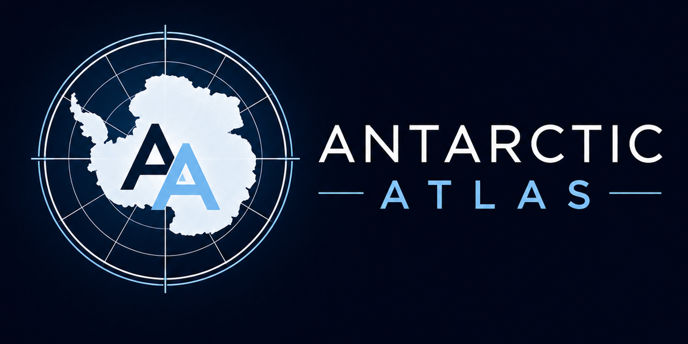

# Antarctic Research Atlas

<p align="center">
  
</p>

**Antarctic Atlas is an interactive educational and research platform for exploring the Antarctic Ice Sheet.**

Current release: **v2.0.5**

[Live Demo](https://antarctic-research-atlas.streamlit.app/)

[Download the latest Windows installer](https://github.com/OmicaHQ/antarctic-atlas/releases/latest)

---

## Project Overview

Antarctic Atlas is the desktop and web implementation of the Antarctic Research Atlas project.

The project transforms an 89-page review paper:

**Noble, T. L. et al. (2020). _The Sensitivity of the Antarctic Ice Sheet to a Changing Climate: Past, Present, and Future._ Reviews of Geophysics, 58, e2019RG000663.**

into a visual, AI-assisted platform where users can explore Antarctic research interactively.

The platform combines scientific visualization, interactive exploration, AI-assisted storytelling, educational tools, and a Windows desktop app for local use.

---

## Features

### Research Universe Explorer


Explore key concepts and relationships in Antarctic Ice Sheet research through an interactive knowledge universe.

### Antarctic System Explorer


Visualize satellite observations and compare different glaciers and ice shelves using multiple observation layers.

### AI Visualizer


Generate scientific stories and animations based on the review paper.

### Mini Research Lab


Conduct interactive experiments and explore Antarctic system responses under different scenarios.

### Research Compass


Explore future research questions, open scientific challenges, and emerging directions in Antarctic science.

### Read Raw Paper

Access the full review paper PDF and navigate it directly within the platform.

---

## Windows Desktop App

The recommended Windows download is the latest installer on the GitHub Releases page:

[Antarctic Atlas v2.0.5 - Windows Desktop Installer](https://github.com/OmicaHQ/antarctic-atlas/releases/tag/v2.0.5)

Installer file:

- `Antarctic-Atlas-v2.0.5-Setup.exe`
- SHA256: `C1F8734F7BBB56CFD7CBF6C3922479B9FCBDE9B34C78EDAB69C02FAA42B4AD11`

The installer creates Start Menu and optional Desktop shortcuts for one-click launch. No Python, Streamlit, or manual dependency setup is required for the installer version.

Note: the installer metadata shows `Omica Chow`, but the installer is not code-signed yet. Windows may still show an unknown-publisher warning until a code-signing certificate is applied.

---

## Run From Source

Clone the repository:

```bash
git clone https://github.com/OmicaHQ/antarctic-atlas.git
cd antarctic-atlas
```

Install dependencies:

```bash
pip install -r requirements.txt
```

Run the Streamlit app locally:

```bash
streamlit run app.py
```

Then open:

```text
http://localhost:8501
```

## API Keys

AI features are optional. For local development, copy `.streamlit/secrets.example.toml` to `.streamlit/secrets.toml` and add your own keys:

```toml
DEEPSEEK_API_KEY = ""
OPENAI_API_KEY = ""
```

Do not commit real API keys. Evidence-only mode works without an API key.

You can also enter and test API keys inside the app's AI Backend settings. The local Ollama backend targets `gemma4:e4b`, so local AI features require Ollama with that model available.

## Distribution Notes

Windows installers are distributed through GitHub Releases. The `release-assets/` folder is kept only for historical and direct installer references.

See `CHANGELOG.md` for version notes.

## Version History

- `v1.0`: Preserved GitHub version before the local desktop and visual polish update.
- `v2.0`: Local version with iOS-style visual polish, desktop packaging support, improved module layouts, local Ollama model update, and UI bug fixes.
- `v2.0.1`: Documentation update for the desktop app side and changelog.
- `v2.0.2`: Bug fix for the Research Universe map knowledge card.
- `v2.0.3`: Windows installer release and Research Universe diagonal glass highlight fix.
- `v2.0.4`: Bug fix for the desktop window icon and remaining Research Universe diagonal background artifact.
- `v2.0.5`: Current Windows desktop release with updated branding, GitHub Release distribution, and installer publisher metadata set to `Omica Chow`.

## Credits

Developed by Omica Chow

Based on:

Noble et al. (2020), Reviews of Geophysics

Built with Streamlit and Python.

## License

This project is licensed under the MIT License.
