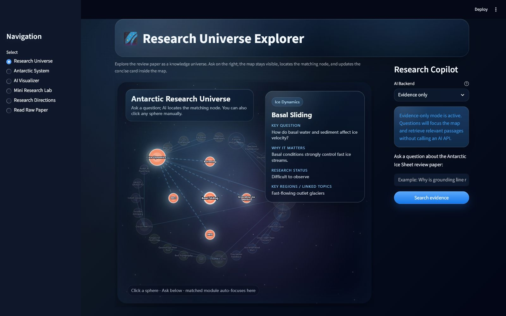
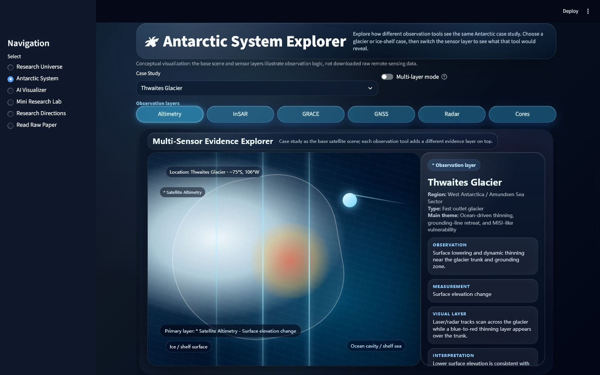
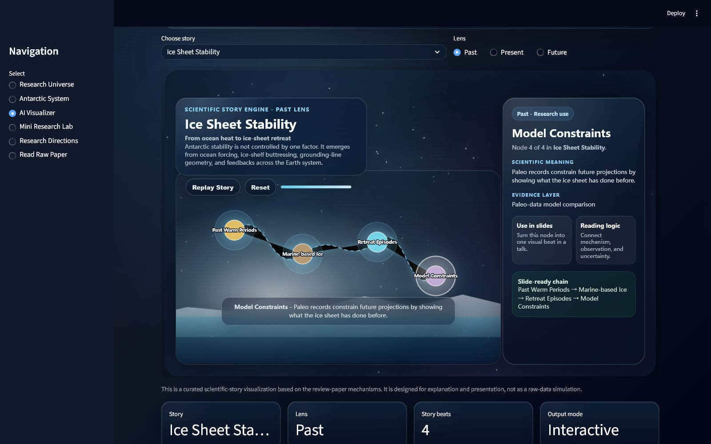
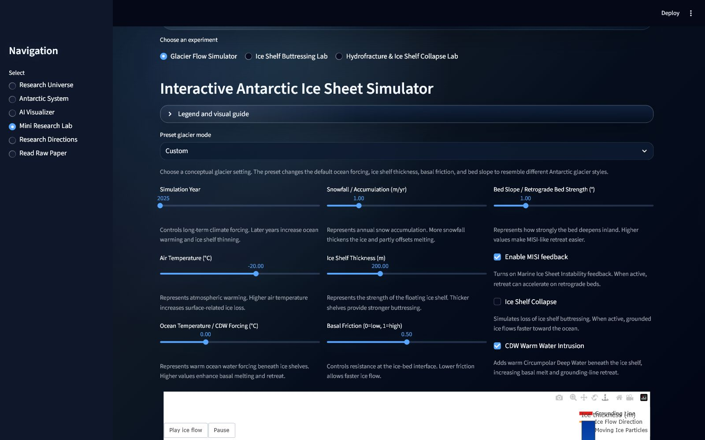
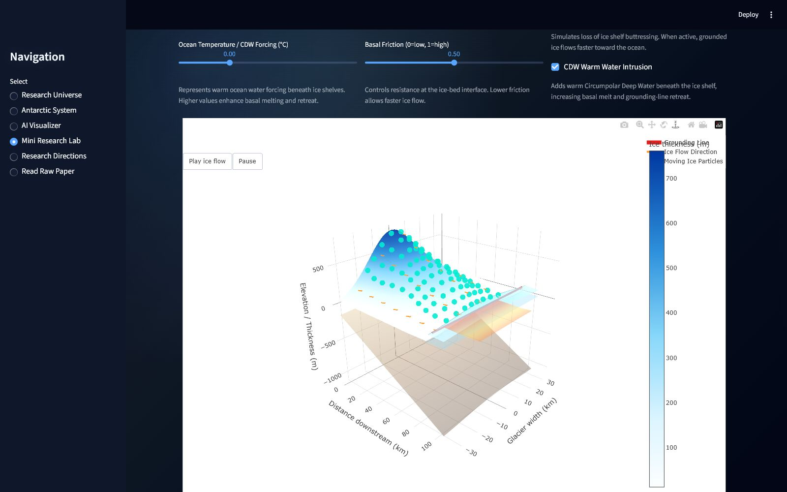
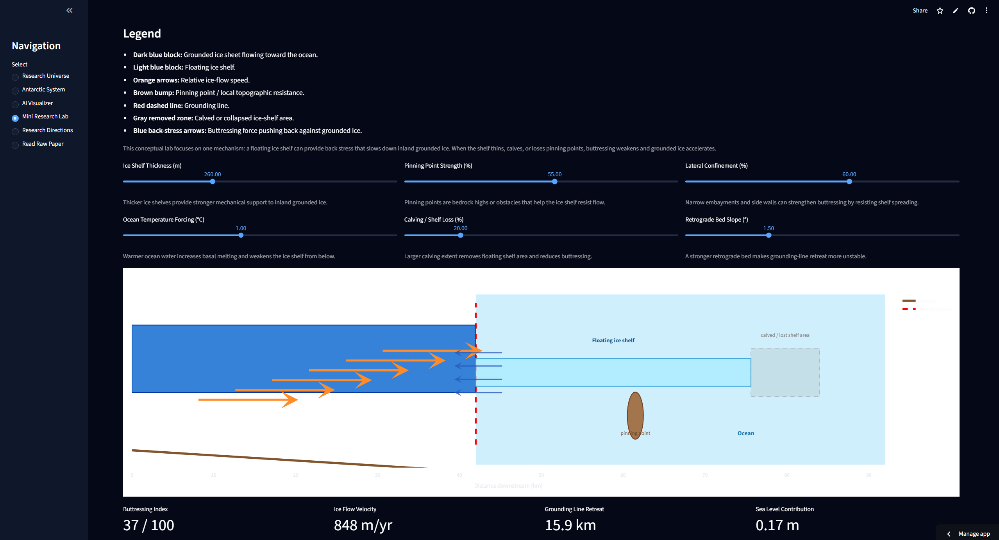
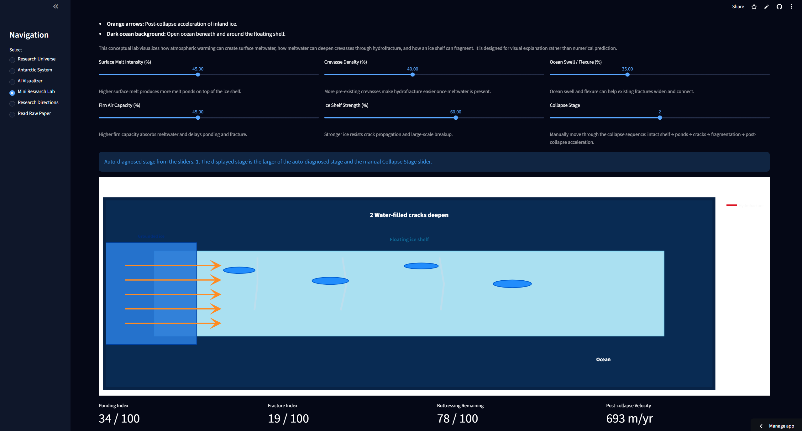
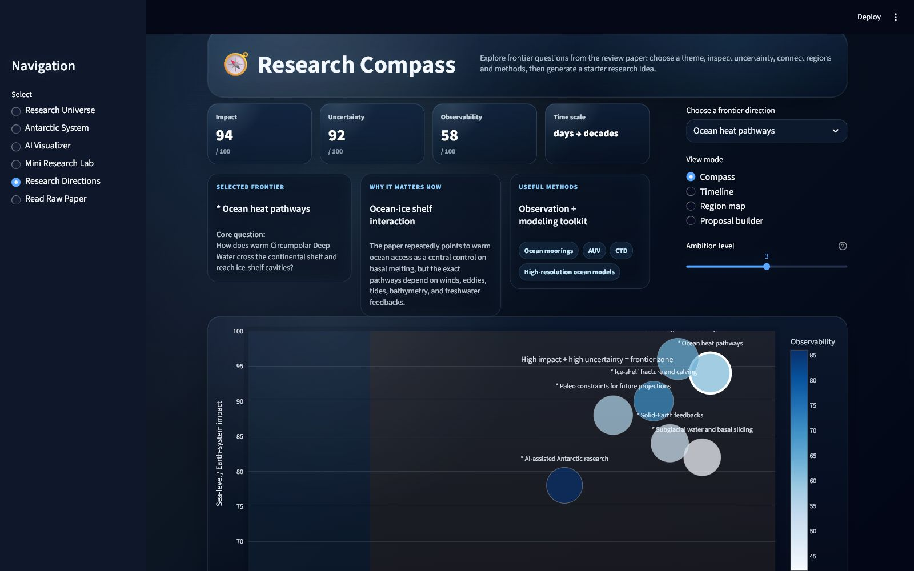

# Antarctic Research Atlas

**An interactive educational and research platform for exploring the Antarctic Ice Sheet**

🌐 **Live Demo**

https://antarctic-research-atlas.streamlit.app/

---

## Project Overview

Antarctic Research Atlas transforms a 89-page review paper:

**Noble, T. L. et al. (2020). *The Sensitivity of the Antarctic Ice Sheet to a Changing Climate: Past, Present, and Future.* Reviews of Geophysics, 58, e2019RG000663.**

into a visual, AI-assisted platform where users can explore Antarctic research interactively.

The platform combines scientific visualization, interactive exploration, AI-assisted storytelling, and educational tools to make Antarctic Ice Sheet research more accessible.

---

## Features

### 🌌 Research Universe Explorer



Explore key concepts and relationships in Antarctic Ice Sheet research through an interactive knowledge universe.

### 🛰️ Antarctic System Explorer



Visualize satellite observations and compare different glaciers and ice shelves using multiple observation layers.

### 🎨 AI Visualizer



Generate scientific stories and animations based on the review paper.

### 🧪 Mini Research Lab









Conduct interactive experiments and explore Antarctic system responses under different scenarios.

### 🧭 Research Compass



Explore future research questions, open scientific challenges, and emerging directions in Antarctic science.

### 📄 Read Raw Paper

Access the full review paper PDF and navigate it directly within the platform.
---

## Why This Project?

Most review papers are read linearly from beginning to end.

This project explores a different approach: transforming a scientific review into an interactive environment where users can navigate concepts, observations, visualizations, experiments, and future research directions.

---

## Technical Notes

- The local AI model based on Ollama only works on the developer's machine.  
- Online users can use DeepSeek API or OpenAI API for AI-driven features.

---

## Getting Started

Clone the repository:

```bash
git clone https://github.com/OmicaHQ/antarctic-atlas.git

Install dependencies:

pip install -r requirements.txt

Run the app locally:

streamlit run app.py

Then open:

http://localhost:8501

```

## Credits

Developed by Omica Chow

Based on:

Noble et al. (2020), Reviews of Geophysics

Built with Streamlit and Python.

## License

This project is licensed under the MIT License.
