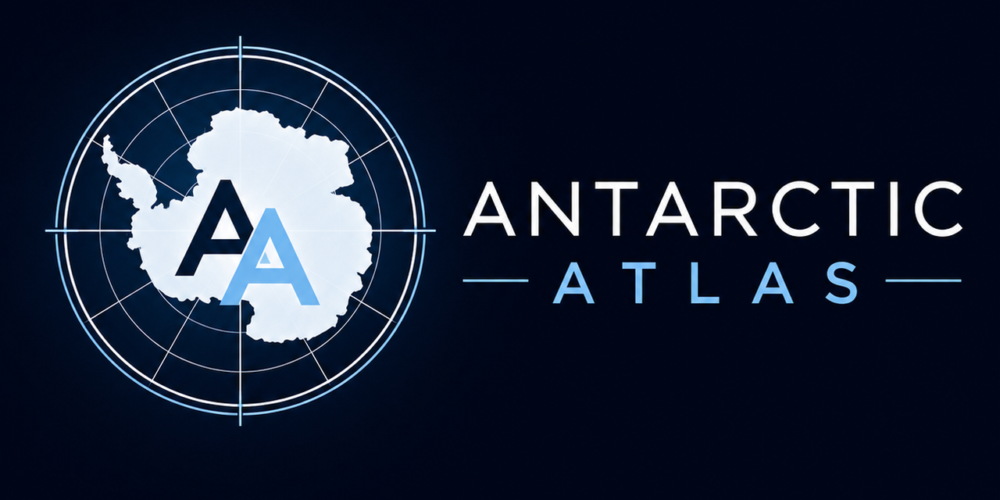
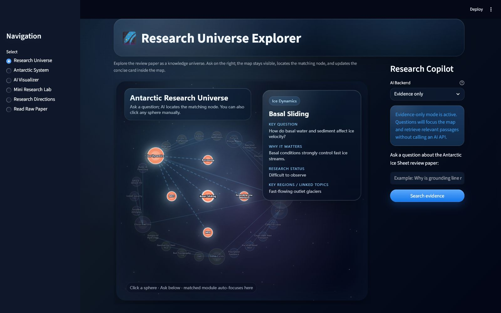
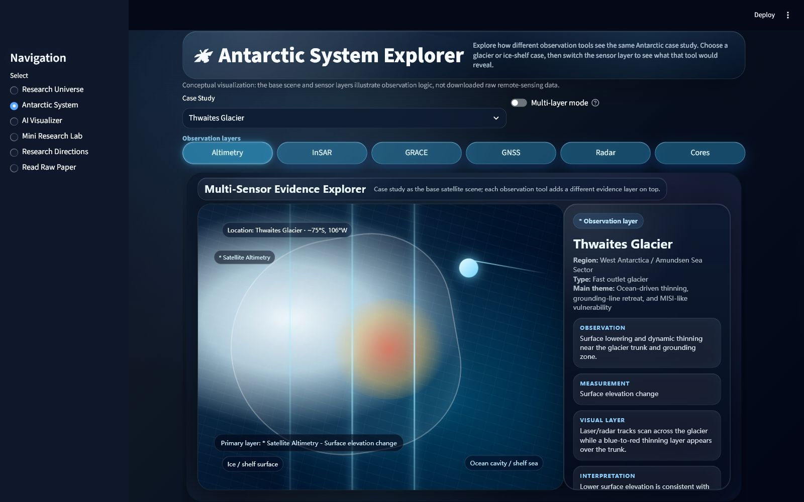
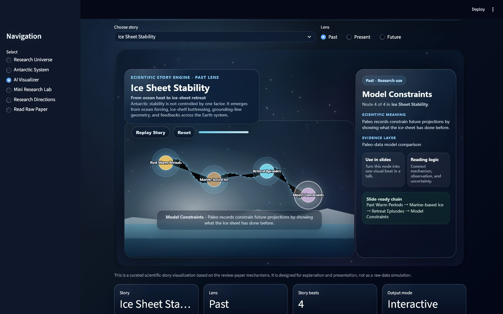
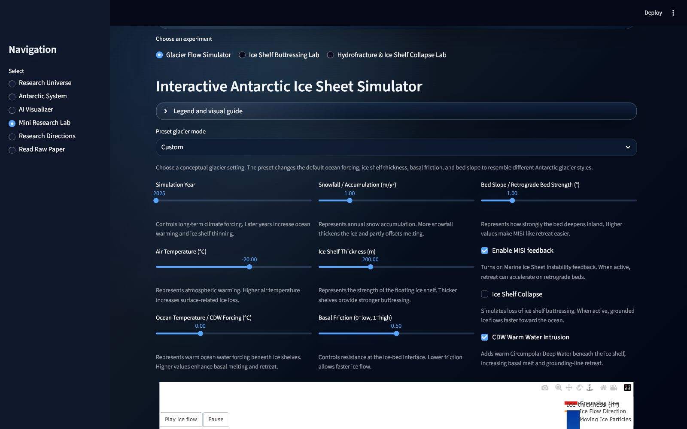
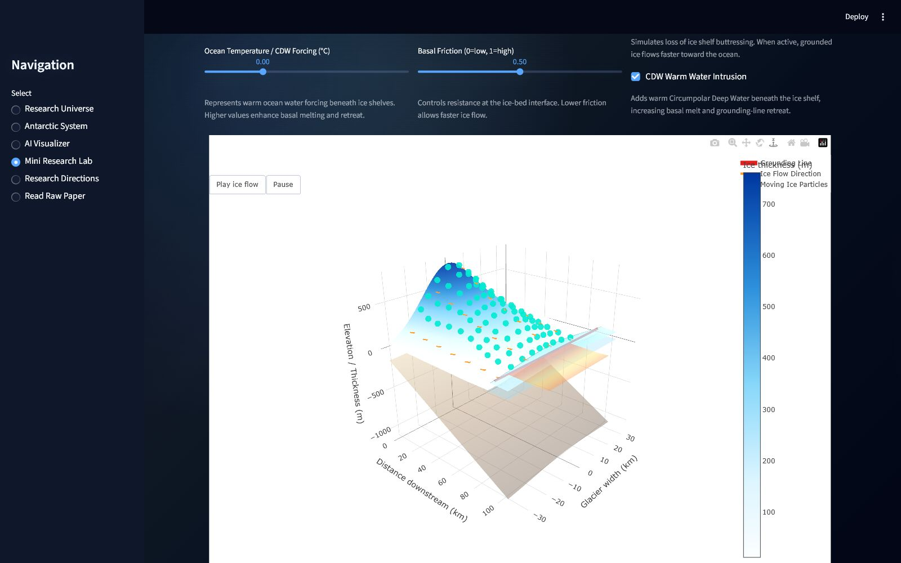
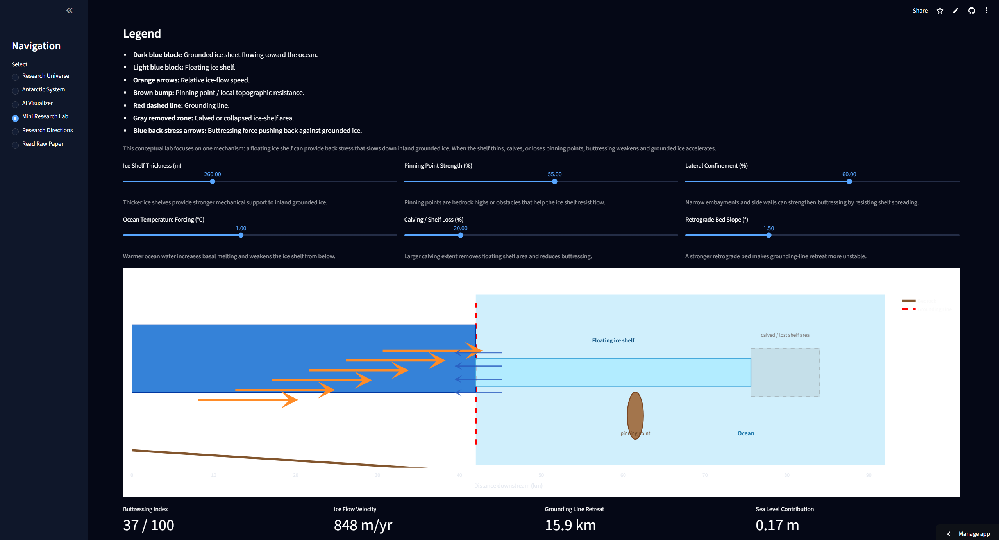
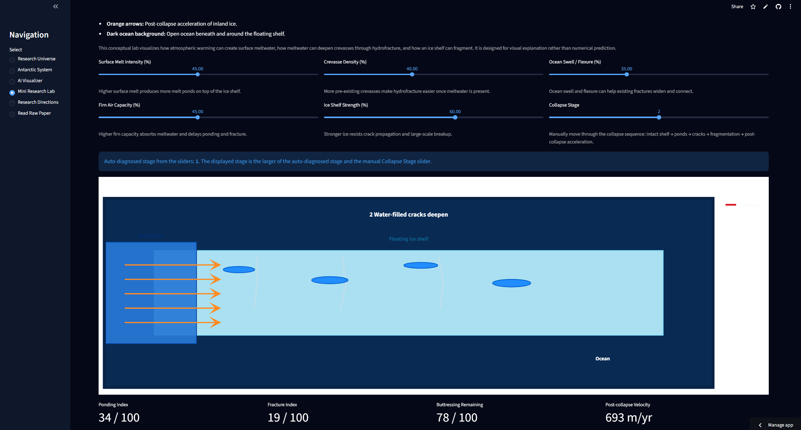
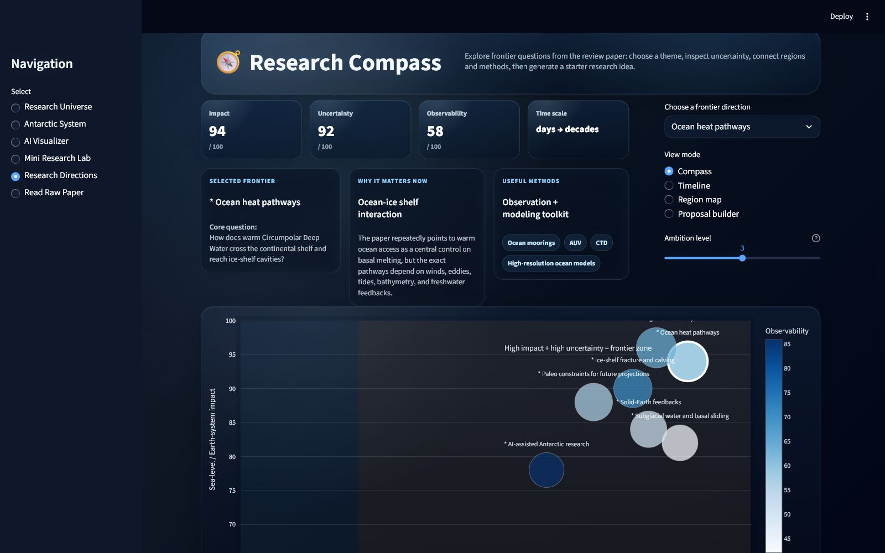
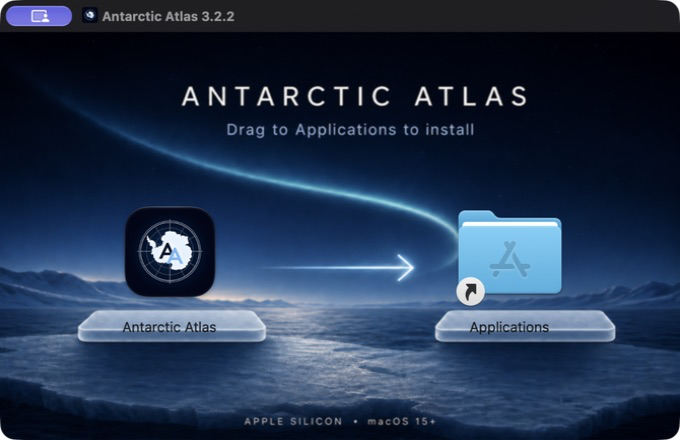

# Antarctic Research Atlas

<p align="center">
  
</p>

**Antarctic Atlas is an interactive educational and research platform for exploring the Antarctic Ice Sheet.**

Available editions:

- **macOS:** [v3.2.2 drag-to-install release for Apple Silicon](https://github.com/OmicaChow/antarctic-atlas/releases/tag/v3.2.2)
- **macOS Preview:** [v4.0.0 native SwiftUI preview for Apple Silicon](https://github.com/OmicaChow/antarctic-atlas/releases/tag/v4.0.0)
- **Windows:** [download the v3.1.2 installer directly](https://github.com/OmicaChow/antarctic-atlas/releases/download/v3.1.2/Antarctic-Atlas-v3.1.2-Setup.exe)
- **Web:** [hosted legacy demo](https://antarctic-research-atlas.streamlit.app/)
  (availability and access may depend on Streamlit)

---

## Project Overview

Antarctic Atlas is a cross-platform research project with published desktop
builds for macOS and Windows, plus a separately hosted legacy web experience.
It transforms an included 89-page review paper:

**Noble, T. L. et al. (2020). _The Sensitivity of the Antarctic Ice Sheet to a
Changing Climate: Past, Present, and Future._ Reviews of Geophysics, 58,
e2019RG000663.**

into a visual, AI-assisted environment for exploring Antarctic science. The
platform combines scientific visualization, interactive exploration,
paper-grounded evidence retrieval, educational tools, and optional AI support.

The current `main` branch is the native macOS development line. Published
Windows and web editions remain part of the project and are linked below, but
their former build/runtime source is not present in current `main`.

---

## Features

### Research Universe Explorer



Explore key concepts and relationships in Antarctic Ice Sheet research through
an interactive knowledge universe. Evidence-only search works locally, while
optional AI backends can help identify relevant modules and answer from
retrieved paper passages.

### Antarctic System Explorer



Visualize satellite observations and compare different glaciers and ice
shelves using multiple observation layers.

### AI Visualizer



Generate conceptual scientific stories and animations based on the review
paper.

### Mini Research Lab









Conduct interactive experiments and explore Antarctic system responses under
different scenarios. These are educational, conceptual simulations rather than
operational forecasts.

### Research Compass / Research Directions



Explore future research questions, open scientific challenges, and emerging
directions in Antarctic science. The current macOS edition calls this module
Research Directions and can export a starter proposal as text.

### Read Raw Paper

Access the complete review paper PDF, navigate by page, and search its extracted
text directly within the desktop app.

---

## macOS Desktop App — v3.2.2

The macOS v3.2.2 build is self-contained and does not require Python or `uv`.

| Requirement | Support |
| --- | --- |
| Mac | Apple Silicon (`arm64`) only; Intel Macs are not supported |
| Operating system | macOS 15.0 or later |
| Primary installer | `Antarctic-Atlas-v3.2.2-macOS-arm64.dmg` |
| Fallback archive | `Antarctic-Atlas-v3.2.2-macOS-arm64.zip` |

<p align="center">
  
</p>

Download the DMG and its checksum from the
[v3.2.2 macOS release](https://github.com/OmicaChow/antarctic-atlas/releases/tag/v3.2.2):

- `Antarctic-Atlas-v3.2.2-macOS-arm64.dmg`
- `Antarctic-Atlas-v3.2.2-macOS-arm64.dmg.sha256`

The release also includes a versioned ZIP and checksum as fallback downloads.

### Verify the macOS download

With both files in `~/Downloads`, run:

```zsh
cd ~/Downloads
shasum -a 256 -c Antarctic-Atlas-v3.2.2-macOS-arm64.dmg.sha256
```

Continue only if the result ends with `OK`. If verification fails, delete both
files and download them again from the official release page.

### Install and approve the first launch

1. Double-click the DMG file.
2. Drag `Antarctic Atlas.app` onto the `Applications` shortcut.
3. Eject the `Antarctic Atlas 3.2.2` disk image.
4. In Applications, Control-click the app and choose **Open**.
5. Choose **Open** again in the confirmation dialog.

The v3.2.2 app is **ad-hoc signed**. It is not signed with an Apple Developer ID
and has not been notarized by Apple. If Gatekeeper still blocks it, attempt to
open it once, then go to **System Settings > Privacy & Security**. In the
Security section choose **Open Anyway**, authenticate, and confirm **Open**.
Only download the app from this repository's official release page.

### Upgrade

Quit Antarctic Atlas, download and verify the new installer, then replace the
existing `Antarctic Atlas.app` in `/Applications`. Settings and the replaceable
paper cache remain outside the app bundle and survive a normal upgrade.

### Uninstall or reset local data

Quit the app and move `/Applications/Antarctic Atlas.app` to the Trash. If it
was installed under `~/Applications`, remove that copy instead.

To remove local data, use Finder's **Go > Go to Folder** command and visit:

- `~/Library/Application Support/Antarctic Atlas/` — contains `settings.json`
- `~/Library/Caches/Antarctic Atlas/` — contains the replaceable `pages.json`
  paper cache

Delete only the Antarctic Atlas folder or named file at each location. Removing
`pages.json` is safe; the included paper will be parsed again on the next
launch.

## Native macOS Preview — v4.0.0

The v4.0.0 Preview is the next-generation SwiftUI/AppKit client. It keeps the
same evidence-grounded paper and six research modules while restoring the
original Windows-era Universe orb language, smooth focus transitions, and
precise orb hit targets. The preview installs beside the stable v3.2.2 app as
`Antarctic Atlas Native Preview.app`.

| Requirement | Support |
| --- | --- |
| Mac | Apple Silicon (`arm64`) only; Intel Macs are not supported |
| Operating system | macOS 15.0 or later |
| Primary installer | `Antarctic-Atlas-v4.0.0-macOS-arm64.dmg` |
| Fallback archive | `Antarctic-Atlas-v4.0.0-macOS-arm64.zip` |

Download the preview installer and checksum from the
[v4.0.0 Preview release](https://github.com/OmicaChow/antarctic-atlas/releases/tag/v4.0.0).
The release is marked **Pre-release** while the native client continues through
parity testing. It is ad-hoc signed and not notarized; on first launch,
Control-click the app in Finder and choose **Open**.

The preview does not replace the stable app. Quit either copy before updating
that copy, and keep the stable v3.2.2 app if you need the published Qt client.

---

## Windows Desktop App — v3.1.2

Windows remains available as the published bilingual Qt installer from the
v3.1.2 release. This Windows download is intentionally pinned to that version;
use the direct installer or its versioned release page below.

[Download `Antarctic-Atlas-v3.1.2-Setup.exe`](https://github.com/OmicaChow/antarctic-atlas/releases/download/v3.1.2/Antarctic-Atlas-v3.1.2-Setup.exe)

[View the Windows v3.1.2 release notes](https://github.com/OmicaChow/antarctic-atlas/releases/tag/v3.1.2)

- Installer: `Antarctic-Atlas-v3.1.2-Setup.exe`
- SHA-256: `394BC66DE8A417BA3B4BC94D1212F9CA2E1A8AC51E0E868CBD893FC451E166FC`

The installer creates Start Menu and optional Desktop shortcuts for one-click
launch. It does not require Python, a Streamlit server, or manual dependency
setup. The installer metadata shows `Omica Chow`, but the installer is not
code-signed, so Windows may display an unknown-publisher warning.

The current `main` branch no longer contains the former Windows packaging
toolchain. Use this published v3.1.2 binary for the documented Windows edition.

---

## Hosted Web Demo

[Visit the hosted Antarctic Atlas legacy demo](https://antarctic-research-atlas.streamlit.app/)

The hosted Streamlit demo is a legacy project edition maintained separately
from the current native macOS source. Its availability and access are controlled
by Streamlit and may require sign-in. Current `main` does **not** contain the
removed Streamlit application needed to reproduce that hosted demo locally;
historical tags and Git history preserve the earlier implementation record.

---

## Privacy and Optional AI in macOS v3.2.2

**Evidence-only mode is local and offline.** It searches the bundled paper,
does not call an AI provider, and sends no telemetry. The app contains no usage
analytics or tracking.

AI support is optional:

- **Local Ollama** sends the question and retrieved paper passages only to the
  Ollama service on `127.0.0.1`.
- **DeepSeek API** or **OpenAI API** sends the question and locally retrieved
  paper passages to the selected online provider. That provider's terms and
  privacy policy apply.
- API keys entered in the app remain in memory for the current run only. The
  app does not save them to settings, disk, or Keychain. Keys supplied through
  environment variables remain managed by the launching environment.

The current DeepSeek V4 choices are `deepseek-v4-pro` and
`deepseek-v4-flash`. Local Ollama targets `gemma4:e4b`.

---

## Develop the Current macOS Source

Current `main` targets an Apple Silicon Mac running macOS 15.0 or later.
Development requires [`uv`](https://docs.astral.sh/uv/); packaging additionally
requires Xcode.app.

Set up and run:

```zsh
git clone https://github.com/OmicaChow/antarctic-atlas.git
cd antarctic-atlas
scripts/setup-macos.sh
.venv/bin/python desktop_qt_app.py
```

Run the full test suite and source smoke test:

```zsh
.venv/bin/python -m pytest tests -q
.venv/bin/python scripts/macos-smoke.py
```

Build and verify the macOS installers:

```zsh
scripts/build-macos.sh
```

The build produces a versioned drag-to-install DMG, fallback ZIP, and SHA-256
files under `dist/`. It checks the dependency environment, `arm64`
architecture, macOS 15 deployment target, signature, ZIP extraction, DMG
layout and Applications shortcut, copied-app integrity, and cold packaged-app
launches. Without an explicit Developer ID identity, it creates the ad-hoc
signature used by the v3.2.2 release. Notarization remains a separate,
currently unperformed step.

This source workflow does not rebuild the Windows v3.1.2 installer or the
hosted Streamlit demo.

---

## Repository Layout and Support

```text
core/                  paper search, models, data loading, and macOS paths
data/                  research topics, areas, and keyword mappings
docs/                  migration and architecture notes
installer/             application and disk-image artwork
locales/               English and Chinese translations
qt_app/                PySide6 pages and interface support
scripts/               macOS setup, validation, and packaging scripts
tests/                 automated tests
desktop_qt_app.py      current native application entry point
VERSION                application and release version
```

Report reproducible problems through
[GitHub Issues](https://github.com/OmicaChow/antarctic-atlas/issues). Include
the platform, app version, operating-system version, exact error text, and steps
to reproduce. Never include an API key in an issue or screenshot.

See the [macOS release guide](docs/MACOS_MIGRATION.md),
[architecture handover](docs/architecture/handover.md), and
[third-party notices](THIRD_PARTY_NOTICES.md).

---

## Version History

- **v4.0.0 Preview:** Native SwiftUI/AppKit macOS client for Apple Silicon with
  source-faithful Universe orb interactions, improved module transitions,
  precision hit testing, and a polished drag-to-Applications preview installer.
- **v3.2.2:** Apple Silicon DMG release with a branded drag-to-Applications
  installer, fixed Finder layout, checksums, and CI-preserved artifacts.
- **v3.2.1:** Stable Apple Silicon macOS release with native Qt packaging,
  bilingual UI, paper-grounded exploration, local/offline evidence mode,
  optional AI providers, Mac-specific install guidance, and release validation.
- **v3.1.2:** Published unified bilingual Qt desktop installer for Windows and
  the direct Windows download retained above.
- **v3.1:** Unified bilingual desktop phase with in-app English/Chinese
  switching and broader localization across widgets, visual scenes, Universe
  labels, and export text.
- **v3.0:** Native Qt desktop reconstruction phase, moving the product from a
  Streamlit-in-a-window approach toward a Qt shell with animated modules,
  WebEngine Research Universe, AI/RAG calls, and packaged delivery.
- **v2:** Streamlit desktop/productization phase with Windows packaging,
  interface refinement, module splitting, and local AI options.
- **v1:** Original Streamlit research atlas and the foundation of the hosted
  legacy web experience.

See [CHANGELOG.md](CHANGELOG.md) for detailed release notes.

## Credits, Scientific Source, and License

Developed by Omica Chow.

The Antarctic Atlas project code is licensed under the [MIT License](LICENSE).
Third-party components retain their own licenses; see
[THIRD_PARTY_NOTICES.md](THIRD_PARTY_NOTICES.md).

The bundled paper is a separate copyrighted scientific work:

> Noble, T. L. et al. (2020). *The Sensitivity of the Antarctic Ice Sheet to a
> Changing Climate: Past, Present, and Future.* Reviews of Geophysics, 58,
> e2019RG000663. [https://doi.org/10.1029/2019RG000663](https://doi.org/10.1029/2019RG000663)

Copyright © 2020 The Authors. The article is distributed under the
[Creative Commons Attribution 4.0 International License](https://creativecommons.org/licenses/by/4.0/)
(CC BY 4.0). Reuse must provide appropriate attribution. The project's MIT
License does not replace or extend to the paper's license.

Source repository: <https://github.com/OmicaChow/antarctic-atlas>
